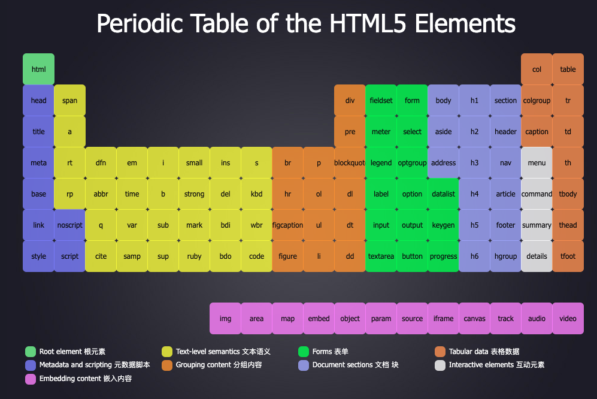

# 笔记

## img元素

image缩写，空元素

src属性：source

alt属性：当图片资源失效时，将使用该属性的文字替代图片

## 和a元素连用
```html
 <a href="http://www.xuanfengge.com/funny/html5/element/" target="_blank">
    
</a>
```
## 和map元素

map：地图

name属性：填写map的名字给a标签的usemap使用，a标签的usemap="#map的name属性值"

子标签：area

- shape属性：形状。circle：圆形。rect：矩形。poly：多边形。
- coords属性：坐标。圆形：原点坐标，加上半径。矩形：左上角坐标和右下角坐标。多边形：每个点的坐标。
- herf属性：要跳转的地址。
- alt属性：当图片资源失效时，将使用该属性的文字替代图片


衡量坐标时，为了避免衡量误差，需要使用专业的衡量工具

ps，pxcode
```html
 <a href="http://www.xuanfengge.com/funny/html5/element/" target="_blank">
        
    </a>

    <map name="elementMap">
        <area shape="circle" coords="429,532,28" href="https://developer.mozilla.org/en-US/docs/Web/HTML/Element/area" alt="">
        <area shape="rect" coords="352,507,403,569" href="https://developer.mozilla.org/en-US/docs/Web/HTML/Element/Img" alt="" target="_blank">
        <area shape="poly" coords="" href="" alt="">
    </map>
```
## 和figure元素

只带、定义，通常用于把图片、图片标题、描述包裹起来

子元素：figcaption  表示指代元素的标题。用于语义化。
```html
<figure>
    <figcaption>
        <h1>HTML元素周期表</h1>
    </figcaption>
    <a href="http://www.xuanfengge.com/funny/html5/element/" target="_blank">
        
    </a>
</figure>
```